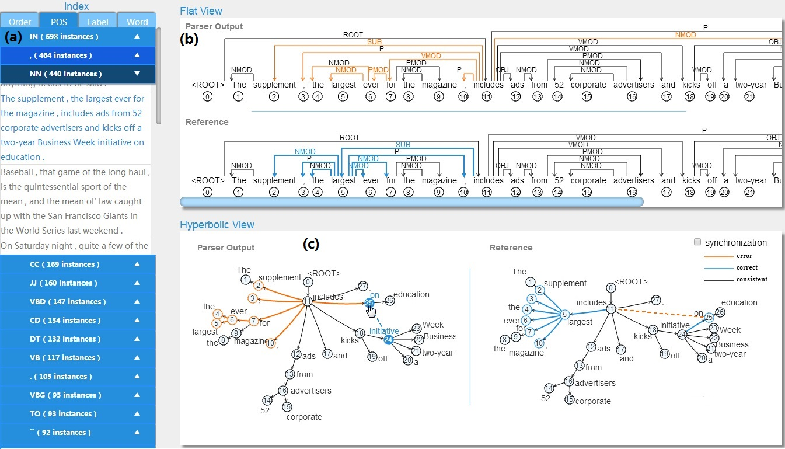

# Hyperbolic Dependency Tree Visualization for Parser Evaluation

Teaser Image: The user interface of our dependency parser visual analysis tool. The inputs to the system include a parsing result file and a reference file, which contains gold-standard dependency trees. Both files are in the CoNLL-X format. The interface contains three panels. On the left, there is an index panel listing sentences by the type of parsing errors, including the POS of incorrectly parsed words (the ''POS'' tab), the label of incorrectly parsed dependency relations (the ''Label'' tab) and the incorrectly parsed word (the ''Word'' tab). A natural order of all the sentences is also included (the ``Order'' tab). On the right, the top panel displays the dependency trees of both the parsing result and the reference in a traditional flat view, as implemented in tools such as MaltEval. The central panel introduces the main innovation of this work, the dependency parsing tree visualization using hyperbolic views.

## INTRODUCTION

Dependency parsing is the task of automatically analyzing the syntax of natural language sentences according to dependency grammars.Visualization has been widely used to help corpus linguists study grammers, and to help computational linguists analyze dependency parser outputs and to find their weaknesses. There are quite a few NLP tools that focus on visualizing the dependency parsing results or integrate the visualization as an important feature, such as MaltEval, MaltDriver and ViZPar. The main innovation of this paper is to introduce the hyperbolic radial tree layout (Figure (c)), which has been well studied in the visualization community, to the task of comparing dependency trees.

## OBJECTIVE

Present a tool to visualize dependency trees in a hyperbolic layout.
Provide visual support for the comparative evaluation of parsing errors.

## PUBLICATION

Le Wang, Yue Zhang and Lei Shi, "Hyperbolic Dependency Tree Visualization for Parser Evaluation", poster paper accepted by IEEE VIS (InfoVis).[[paper](//iscas-vis.github.io/researches/LeWang/Hyperbolic.pdf)][[poster](//iscas-vis.github.io/researches/LeWang/Hyperbolic_poster.pdf)]

## MEMBER

Le Wang (ISCAS), Yue Zhang (SUTD), Lei Shi (ISCAS)
