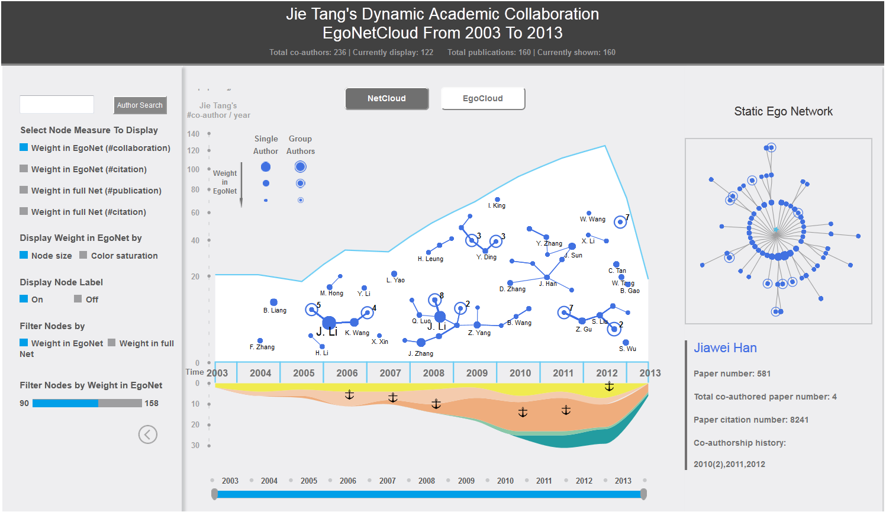

# EgoNetCloud

### Event-based Egocentric Dynamic Network Visualization
 

**Teaser Image**: EgoNetCloud interface composed of three components: control panel on the left, dynamic EgoNetCloud view in the center, and static egocentric network view on the right. While the static view in radial tree gives an overview map to the egocentric network, the EgoNetCloud illustrates both temporal, topological and contextual information of the egocentric network. Through the controlpanel, various interactions can be applied to the network data to facilitate information recall and analysis.

## Demo

[Youtube 25sec](https://youtu.be/owArT83e2OU)

## CONTRIBUTIONS

1. Data-driven empirical algorithms, to prune, compress and filter event-based egocentric dynamic networks into smaller but more informative abstractions
2. EgoNetCloud visual metaphor and interactions, to display and explore both the egocentric network structure and the temporal dynamics
3. Fast and constrained layout computation, to fulfill the requirement of the new visual metaphor and maintain fine readability
4. Comprehensive evaluations, by a user study comparing our system with a production system, and two real-world case studies to demonstrate the effectiveness of the EgoNetCloud design

## PUBLICATION

Qingsong Liu, Yifan Hu, Lei Shi, Xinzhu Mu, Yutao Zhang, Jie Tang,“EgoNetCloud: Event-based Egocentric Dynamic Network Visualization”, *IEEE Conference on Visual Analytics Science and Technology (part of IEEE VIS), Chicago, USA, October 2015.* [[paper](//iscas-vis.github.io/researches/QingsongLiu/EgoNetCloud.pdf)]
 
## MEMBER

Leader: Qingsong Liu (ISCAS)

Advisor: Lei Shi (ISCAS)

Collaborator: Yifan Hu (Yahoo Labs), Xinzhu Mu(Tsinghua University), Yutao Zhang(Tsinghua University), Jie Tang(Tsinghua University)
