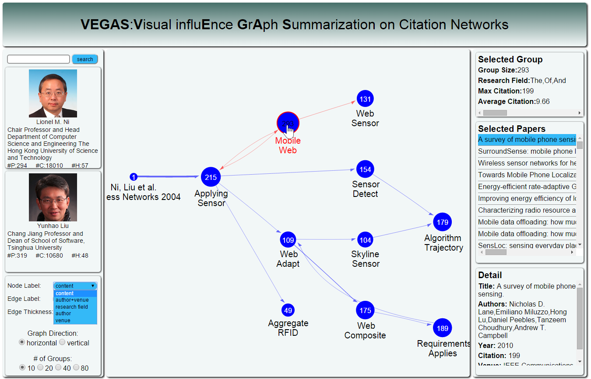

# Influence Visualization of Scientific Paper Through Flow-based Citation Network Summarization
 

**Teaser Image**: Influence Graph Summarization of [Manifold-ranking based image retrieval]: (a) the author information, (b) the control panel, (c) the influence graph summarization, (d) the information of the selected cluster, (e) the papers list of the select cluster, (f) the detail information of the selected paper, ①-③represent the corresponding clusters.

## INTRODUCTION

VEGAS is an online system that can illustrate the influence of one scientific paper on citation networks via the influence graph summarization and visualization. The system is built over an algorithm pipeline that maximizes the rate of influence flows in the final summarization. Both visualization and interaction designs are described with respect to a real usage scenario of the VEGAS system.

## OBJECTIVE

1. Describe the visualization and interaction design in the VEGAS system.
2. Demonstrate the online VEGAS system which can visualize the IGS result according to user queries.

## PUBLICATION

Yue Su, Sibai Sun, Yuan Xuan and Lei Shi, "Influence Visualization of Scientific Paper Through Flow-based Citation Network Summarization", demo paper, accepted by International Conference on Data Mining 2015. [[paper](//iscas-vis.github.io/researches/YueSu/vegas.pdf)]

## MEMBER

Yue Su (ISCAS), Sibai Sun (IPCAS), Yuan Xuan(Fudan University) and Lei Shi (ISCAS)
